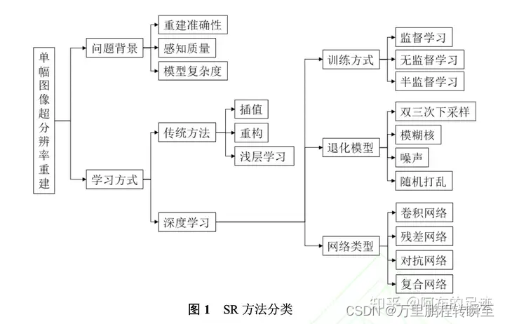

# 最新图像超分DRCT网络及工具箱使用文档



代码库：https://github.com/ming053l/DRCT.git

## 1.环境安装：

官方指导，安装requirements.txt失败可选择阿里镜像http://mirrors.aliyun.com/pypi/simple/

```shell
git clone https://github.com/ming053l/DRCT.git
conda create --name drct python=3.8 -y
conda activate drct
# CUDA 11.6
conda install pytorch==1.12.1 torchvision==0.13.1 torchaudio==0.12.1 cudatoolkit=11.6 -c pytorch -c conda-forge
cd DRCT
pip install -r requirements.txt
python setup.py develop
```

## 2.数据集处理

使用了  real库的scripts/generate_multiscale_DF2K.py  和scripts/generate_meta_info.py脚本 

但是一些细节需要修改，将

### generate_multiscale_DF2K.py

脚本的main函做一下微小修改，使生成的图片不加额外后缀

```python
import argparse
import glob
import os
from PIL import Image


def main(args):
    # For DF2K, we consider the following three scales,
    # and the smallest image whose shortest edge is 400
    scale_list = [1, 0.25]
    # scale_list = [0.75, 0.5, 1 / 3]
    shortest_edge = 400

    path_list = sorted(glob.glob(os.path.join(args.input, '*')))
    for path in path_list:
        print(path)
        basename = os.path.splitext(os.path.basename(path))[0]

        img = Image.open(path)
        width, height = img.size
        for idx, scale in enumerate(scale_list):
            print(f'\t{scale:.2f}')
            rlt = img.resize((int(width * scale), int(height * scale)), resample=Image.LANCZOS)
            if not os.path.exists(os.path.join(args.output, f'{scale_list[idx]}')):
                # 如果文件夹不存在，使用os.makedirs()创建文件夹
                os.makedirs(os.path.join(args.output, f'{scale_list[idx]}'))
            rlt.save(os.path.join(args.output, f'{scale_list[idx]}', f'{basename}.png'))#T{idx}

        # save the smallest image which the shortest edge is 400
        if width < height:
            ratio = height / width
            width = shortest_edge
            height = int(width * ratio)
        else:
            ratio = width / height
            height = shortest_edge
            width = int(height * ratio)
        rlt = img.resize((int(width), int(height)), resample=Image.LANCZOS)
        if not os.path.exists(os.path.join(args.output, 'shortest400')):
            os.makedirs(os.path.join(args.output, 'shortest400'))
        rlt.save(os.path.join(args.output, 'shortest400', f'{basename}.png'))#T{idx+1}


if __name__ == '__main__':
    """Generate multi-scale versions for GT images with LANCZOS resampling.
    It is now used for DF2K dataset (DIV2K + Flickr 2K)
    """
    parser = argparse.ArgumentParser()
    parser.add_argument('--input', type=str, default='datasets/DF2K/DF2K_HR', help='Input folder')
    parser.add_argument('--output', type=str, default='datasets/DF2K/DF2K_multiscale', help='Output folder')
    args = parser.parse_args()

    os.makedirs(args.output, exist_ok=True)
    main(args)

```

### generate_meta_info.py脚本

```python
import argparse
import cv2
import glob
import os


def main(args):
    txt_file = open(args.meta_info, 'w')
    for folder, root in zip(args.input, args.root):
        img_paths = sorted(glob.glob(os.path.join(folder, '*')))
        for img_path in img_paths:
            status = True
            if args.check:
                # read the image once for check, as some images may have errors
                try:
                    img = cv2.imread(img_path)
                except (IOError, OSError) as error:
                    print(f'Read {img_path} error: {error}')
                    status = False
                if img is None:
                    status = False
                    print(f'Img is None: {img_path}')
            if status:
                # get the relative path
                img_name = os.path.relpath(img_path, root)
                print(img_name)
                txt_file.write(f'{img_name}\n')


if __name__ == '__main__':
    """Generate meta info (txt file) for only Ground-Truth images.

    It can also generate meta info from several folders into one txt file.
    """
    parser = argparse.ArgumentParser()
    parser.add_argument(
        '--input',
        nargs='+',
        default=['datasets/DF2K/DF2K_HR', 'datasets/DF2K/DF2K_multiscale'],
        help='Input folder, can be a list')
    parser.add_argument(
        '--root',
        nargs='+',
        default=['datasets/DF2K', 'datasets/DF2K'],
        help='Folder root, should have the length as input folders')
    parser.add_argument(
        '--meta_info',
        type=str,
        default='datasets/DF2K/meta_info/meta_info_DF2Kmultiscale.txt',
        help='txt path for meta info')
    parser.add_argument('--check', action='store_true', help='Read image to check whether it is ok')
    args = parser.parse_args()

    assert len(args.input) == len(args.root), ('Input folder and folder root should have the same length, but got '
                                               f'{len(args.input)} and {len(args.root)}.')
    os.makedirs(os.path.dirname(args.meta_info), exist_ok=True)

    main(args)

```


```shell
python generate_multiscale_DF2K.py --input "/root/build_datasets/L_Aerial_chicago/img_dir/val/" --output /root/mms/Real-ESRGAN/datasets/L_Aerial_chicago_multiscale

python generate_meta_info.py --input /root/mms/Real-ESRGAN/datasets/L_Aerial_chicago_multiscale/1, /root/mms/Real-ESRGAN/datasets/L_Aerial_chicago_multiscale/0.25 --root /root/mms/Real-ESRGAN/datasets/L_Aerial_chicago_multiscale/1, /root/mms/Real-ESRGAN/datasets/L_Aerial_chicago_multiscale/0.25 --meta_info /root/mms/Real-ESRGAN/datasets/L_Aerial_chicago_multiscale/meta_info_L_Aerial_chicago_multiscale.txt
```


官方与训练权重

**Benchmark results on SRx4 without x2 pretraining. Mulit-Adds are calculated for a 64x64 input.**

|                            Model                             | Params | Multi-Adds | Forward | FLOPs  |     Set5     |    Set14     | BSD100 | Urban100 | Manga109 |                         Training Log                         |
| :----------------------------------------------------------: | :----: | :--------: | :-----: | :----: | :----------: | :----------: | :----: | :------: | :------: | :----------------------------------------------------------: |
|          [HAT](https://github.com/XPixelGroup/HAT)           | 20.77M |   11.22G   |  2053M  | 42.18G |    33.04     |    29.23     | 28.00  |  27.97   |  32.48   |                              -                               |
| [DRCT](https://drive.google.com/file/d/1jw2UWAersWZecPq-c_g5RM3mDOoc_cbd/view?usp=sharing) | 14.13M |   5.92G    |  1857M  | 7.92G  |    33.11     |    29.35     | 28.18  |  28.06   |  32.59   |                              -                               |
|         [HAT-L](https://github.com/XPixelGroup/HAT)          | 40.84M |   76.69G   |  5165M  | 79.60G |    33.30     |    29.47     | 28.09  |  28.60   |  33.09   |                              -                               |
| [DRCT-L](https://drive.google.com/file/d/1bVxvA6QFbne2se0CQJ-jyHFy94UOi3h5/view?usp=sharing) | 27.58M |   9.20G    |  4278M  | 11.07G |    33.37     |    29.54     | 28.16  |  28.70   |  33.14   |                              -                               |
| [DRCT-XL (pretrained on ImageNet)](https://drive.google.com/file/d/1uLGwmSko9uF82X4OPOMw3xfM3stlnYZ-/view?usp=sharing) |   -    |     -      |    -    |   -    | 32.97 / 0.91 | 29.08 / 0.80 |   -    |    -     |    -     | [log](https://drive.google.com/file/d/1kl2r9TbQ8TR-sOdzvCcOZ9eqNsmIldGH/view?usp=drive_link) |

**Real DRCT GAN SRx4. (Coming Soon)**

|                            Model                             |                        Training Data                         |                          Checkpoint                          |                             Log                              |
| :----------------------------------------------------------: | :----------------------------------------------------------: | :----------------------------------------------------------: | :----------------------------------------------------------: |
| [Real-DRCT-GAN_MSE_Model](https://drive.google.com/drive/folders/1Y4LRVrIaYLHZo2X2z684bg5zzg5FSSRF?usp=sharing) | [DF2K + OST300](https://www.kaggle.com/datasets/thaihoa1476050/df2k-ost/code) | [Checkpoint](https://drive.google.com/file/d/1rfV_ExLtfjdHygWGJ3VUYgyn9UkzSwbZ/view?usp=sharing) | [Log](https://drive.google.com/file/d/1kl2r9TbQ8TR-sOdzvCcOZ9eqNsmIldGH/view?usp=drive_link) |
| [Real-DRCT-GAN_Finetuned from MSE](https://drive.google.com/file/d/1DnEb1G58xumuMmXoqiLG2lbYZOVbz_Kp/view?usp=drive_link) | [DF2K + OST300](https://www.kaggle.com/datasets/thaihoa1476050/df2k-ost/code) | [Checkpoint](https://drive.google.com/file/d/1DnEb1G58xumuMmXoqiLG2lbYZOVbz_Kp/view?usp=drive_link) | [Log](https://drive.google.com/file/d/15aBV-FFi7I4esUb1vzRmrjMccc5cEEY4/view?usp=drive_link) |

官方权重可以放入/checkpoints目录中

## 3.训练配置

```shell
训练代码调用
python drct/train.py -opt /root/mms/DRCT/configs_of_mine/train_DRCT_SRx4_from_scratch.yml
如果rank报错，在train.py中加入以下代码
    import os
    os.environ['RANK'] = '0'

多卡训练
CUDA_VISIBLE_DEVICES=0 python -m torch.distributed.launch --nproc_per_node=1 --master_port=4321 drct/train.py -opt /root/mms/DRCT/configs_of_mine/train_DRCT_SRx4_from_scratch.yml --launcher pytorch
```

## 4.转onnx  

| 参数       | 功能                                   | 默认    |
| ---------- | -------------------------------------- | ------- |
| input      | 要转换的pth权重                        | ***.pth |
| input_size | onnx的固定输入图像大小                 | 64      |
| output     | onnx权重的输出路径                     | **.onnx |
| params     | 模型的参数和它们的指数移动平均，不要改 | False   |


```python
import argparse
import torch
import torch.onnx
from basicsr.archs.rrdbnet_arch import RRDBNet
from drct.archs.DRCT_arch import *

def main(args):
    # An instance of the model
    # set up model (DRCT-L)
    # model = DRCT(upscale=4, in_chans=3,  img_size= 64, window_size= 16, compress_ratio= 3,squeeze_factor= 30,
    #                     conv_scale= 0.01, overlap_ratio= 0.5, img_range= 1., depths= [6, 6, 6, 6, 6, 6, 6, 6, 6, 6, 6, 6],
    #                     embed_dim= 180, num_heads= [6, 6, 6, 6, 6, 6, 6, 6, 6, 6, 6, 6], gc= 32,
    #                     mlp_ratio= 2, upsampler= 'pixelshuffle', resi_connection= '1conv')

    # set up model (DRCT)
    model = DRCT(
        upscale=4,
        in_chans=3,
        img_size=64,
        window_size=16,
        compress_ratio=3,
        squeeze_factor=30,
        conv_scale=0.01,
        overlap_ratio=0.5,
        img_range=1.,
        depths=[6, 6, 6, 6, 6, 6],
        embed_dim=180,
        num_heads=[6, 6, 6, 6, 6, 6],
        mlp_ratio= 2,
        upsampler= 'pixelshuffle',
        resi_connection= '1conv')

    if args.params:
        keyname = 'params'
    else:
        keyname = 'params_ema'
    model.load_state_dict(torch.load(args.input)[keyname])
    # set the train mode to false since we will only run the forward pass.
    model.train(False)
    model.cpu().eval()

    # An example input
    x = torch.rand(1, 3, args.input_size, args.input_size)
    # Export the model
    with torch.no_grad():
        torch_out = torch.onnx._export(model, x, args.output, opset_version=11, export_params=True)
    print(torch_out.shape)


if __name__ == '__main__':
    """Convert pytorch model to onnx models"""
    parser = argparse.ArgumentParser()
    parser.add_argument(
        '--input', type=str, default='/root/mms/DRCT/experiments/train_DRCT_SRx4_from_scratch/models/net_g_10000.pth', help='Input model path')
    parser.add_argument('--input_size', type=int, default=64, help='network input img size, default 64')
    parser.add_argument('--output', type=str, default='DRCT_X4_inputsize64.onnx', help='Output onnx path')
    parser.add_argument('--params', action='store_false', default=False, help='Use params instead of params_ema')
    args = parser.parse_args()

    main(args)
    print("Done!")

```

## 5.推理


```shell
全图x4推理一个文件夹中所有图片
python inference.py --input /root/mms/PaddleGAN-develop/data/Set14/LRbicx4/ --output results/Set14_infer --model_path /root/mms/DRCT/checkpoints/DRCT_X4.pth
python inference.py --input /root/mms/Real-ESRGAN/datasets/L_Aerial_chicago_multiscale/0.25 --output results/0.25_infer --model_path /root/mms/DRCT/experiments/train_DRCT_SRx4_from_scratch/models/net_g_10000.pth

```


pth推理    inference.py

```python
import argparse
import cv2
import glob
import numpy as np
import os
import torch

from drct.archs.DRCT_arch import *
#from drct.data import *
#from drct.models import *

def main():
    parser = argparse.ArgumentParser()
    parser.add_argument(
        '--model_path',
        type=str,
        default=  # noqa: E251
        "checkpoints/DRCT-L.pth"  # noqa: E501
    )
    parser.add_argument('--input', type=str, default='datasets/onnx_inf', help='input test image folder')
    parser.add_argument('--output', type=str, default='results/DRCT128', help='output folder')
    parser.add_argument('--scale', type=int, default=4, help='scale factor: 1, 2, 3, 4')
    #parser.add_argument('--window_size', type=int, default=16, help='16')
    
    parser.add_argument('--tile', type=int, default=128, help='Tile size, None for no tile during testing (testing as a whole)')
    parser.add_argument('--tile_overlap', type=int, default=32, help='Overlapping of different tiles')
    
    args = parser.parse_args()

    device = torch.device('cuda' if torch.cuda.is_available() else 'cpu')
    # set up model (DRCT-L)
    # model = DRCT(upscale=4, in_chans=3,  img_size= 64, window_size= 16, compress_ratio= 3,squeeze_factor= 30,
    #                     conv_scale= 0.01, overlap_ratio= 0.5, img_range= 1., depths= [6, 6, 6, 6, 6, 6, 6, 6, 6, 6, 6, 6],
    #                     embed_dim= 180, num_heads= [6, 6, 6, 6, 6, 6, 6, 6, 6, 6, 6, 6], gc= 32,
    #                     mlp_ratio= 2, upsampler= 'pixelshuffle', resi_connection= '1conv')

    # set up model (DRCT)
    model = DRCT(upscale=4,
                 in_chans=3,
                img_size=64,
                window_size=16,
                compress_ratio=3,
                squeeze_factor=30,
                conv_scale=0.01,
                overlap_ratio=0.5,
                img_range=1.,
                depths=[6, 6, 6, 6, 6, 6],
                embed_dim=180,
                num_heads=[6, 6, 6, 6, 6, 6],
                mlp_ratio= 2,
                upsampler= 'pixelshuffle',
                resi_connection= '1conv')

    model.load_state_dict(torch.load(args.model_path)['params'], strict=True)
    model.eval()
    model = model.to(device)
    
    # print(model)
    
    window_size = 16
    
    os.makedirs(args.output, exist_ok=True)
    for idx, path in enumerate(sorted(glob.glob(os.path.join(args.input, '*')))):
        imgname = os.path.splitext(os.path.basename(path))[0]
        print('Testing', idx, imgname)
        # read image
        img = cv2.imread(path, cv2.IMREAD_COLOR).astype(np.float32) / 255.
        img = torch.from_numpy(np.transpose(img[:, :, [2, 1, 0]], (2, 0, 1))).float()
        
        #img = torch.from_numpy(np.transpose(img[:, :, [2, 1, 0]], (2, 0, 1))).float()
        img = img.unsqueeze(0).to(device)
        #print(img.shape)
        # inference
        try:
            with torch.no_grad():
                #output = model(img)
                _, _, h_old, w_old = img.size()
                h_pad = (h_old // window_size + 1) * window_size - h_old
                w_pad = (w_old // window_size + 1) * window_size - w_old
                img = torch.cat([img, torch.flip(img, [2])], 2)[:, :, :h_old + h_pad, :]
                img = torch.cat([img, torch.flip(img, [3])], 3)[:, :, :, :w_old + w_pad]
                output = test(img, model, args, window_size)
                output = output[..., :h_old * args.scale, :w_old * args.scale]

        except Exception as error:
            print('Error', error, imgname)
        else:
            # save image
            output = output.data.squeeze().float().cpu().clamp_(0, 1).numpy()
            output = np.transpose(output[[2, 1, 0], :, :], (1, 2, 0))
            output = (output * 255.0).round().astype(np.uint8)
            cv2.imwrite(os.path.join(args.output, f'{imgname}.png'), output)


def test(img_lq, model, args, window_size):
    if args.tile is None:
        # test the image as a whole
        output = model(img_lq)
    else:
        # test the image tile by tile
        b, c, h, w = img_lq.size()
        tile = min(args.tile, h, w)
        assert tile % window_size == 0, "tile size should be a multiple of window_size"
        tile_overlap = args.tile_overlap
        sf = args.scale

        stride = tile - tile_overlap
        h_idx_list = list(range(0, h-tile, stride)) + [h-tile]
        w_idx_list = list(range(0, w-tile, stride)) + [w-tile]
        E = torch.zeros(b, c, h*sf, w*sf).type_as(img_lq)
        W = torch.zeros_like(E)

        for h_idx in h_idx_list:
            for w_idx in w_idx_list:
                in_patch = img_lq[..., h_idx:h_idx+tile, w_idx:w_idx+tile]
                out_patch = model(in_patch)
                out_patch_mask = torch.ones_like(out_patch)

                E[..., h_idx*sf:(h_idx+tile)*sf, w_idx*sf:(w_idx+tile)*sf].add_(out_patch)
                W[..., h_idx*sf:(h_idx+tile)*sf, w_idx*sf:(w_idx+tile)*sf].add_(out_patch_mask)
        output = E.div_(W)

    return output


if __name__ == '__main__':
    main()

```

onnx推理   onnx_infer.py

| 参数         | 说明                   | 默认                             |
| ------------ | ---------------------- | -------------------------------- |
| onnx_path    | onnx权重路径           | ***.onnx                         |
| input        | 推理图片的文件夹路径   |                                  |
| output       | 推理图片的文件输出路径 |                                  |
| scale        | 超分重建倍率           | 4                                |
| tile         | 滑窗大小               | 64/128，务必与onnx的输入大小一致 |
| tile_overlap | 滑窗重叠大小           | 32                               |


```python
from PIL import Image
import numpy as np
import cv2
import onnxruntime
import os
import datetime


import argparse
import cv2
import glob
import numpy as np
import os
import torch

from drct.archs.DRCT_arch import *
#from drct.data import *
#from drct.models import *

def main():
    parser = argparse.ArgumentParser()
    parser.add_argument(
        '--onnx_path',
        type=str,
        default=  # noqa: E251
        "/root/mms/DRCT/DRCT_X4_input128.onnx"  # noqa: E501
    )
    parser.add_argument('--input', type=str, default='/root/mms/DRCT/datasets/onnx_inf', help='input test image folder')
    parser.add_argument('--output', type=str, default='results/DRCT128', help='output folder')
    parser.add_argument('--scale', type=int, default=4, help='scale factor: 1, 2, 3, 4')
    #parser.add_argument('--window_size', type=int, default=16, help='16')
    
    parser.add_argument('--tile', type=int, default=128, help='Tile size, None for no tile during testing (testing as a whole)')
    parser.add_argument('--tile_overlap', type=int, default=32, help='Overlapping of different tiles')
    
    args = parser.parse_args()

    device = torch.device('cuda' if torch.cuda.is_available() else 'cpu')
    model = onnxruntime.InferenceSession(args.onnx_path, providers=['TensorrtExecutionProvider', 'CUDAExecutionProvider'])
    
    window_size = 16
    
    os.makedirs(args.output, exist_ok=True)
    for idx, path in enumerate(sorted(glob.glob(os.path.join(args.input, '*')))):
        imgname = os.path.splitext(os.path.basename(path))[0]
        print('Testing', idx, imgname)
        # read image
        img = cv2.imread(path, cv2.IMREAD_COLOR).astype(np.float32) / 255.
        img = torch.from_numpy(np.transpose(img[:, :, [2, 1, 0]], (2, 0, 1))).float()
        
        #img = torch.from_numpy(np.transpose(img[:, :, [2, 1, 0]], (2, 0, 1))).float()
        img = img.unsqueeze(0)
        # img = img.unsqueeze(0).to(device)
        #print(img.shape)
        # inference
        try:
            with torch.no_grad():
                #output = model(img)
                _, _, h_old, w_old = img.size()
                h_pad = (h_old // window_size + 1) * window_size - h_old
                w_pad = (w_old // window_size + 1) * window_size - w_old
                img = torch.cat([img, torch.flip(img, [2])], 2)[:, :, :h_old + h_pad, :]
                img = torch.cat([img, torch.flip(img, [3])], 3)[:, :, :, :w_old + w_pad]

                output = test(img, model, args, window_size)
                output = output[..., :h_old * args.scale, :w_old * args.scale]

        except Exception as error:
            print('Error', error, imgname)
        else:
            # save image
            output = output.data.squeeze().float().cpu().clamp_(0, 1).numpy()
            output = np.transpose(output[[2, 1, 0], :, :], (1, 2, 0))
            output = (output * 255.0).round().astype(np.uint8)
            cv2.imwrite(os.path.join(args.output, f'{imgname}_onnx_infer.png'), output)


def test(img_lq, model, args, window_size):
    if args.tile is None:
        # test the image as a whole
        output = model(img_lq)
    else:
        # test the image tile by tile
        b, c, h, w = img_lq.size()
        tile = min(args.tile, h, w)
        assert tile % window_size == 0, "tile size should be a multiple of window_size"
        tile_overlap = args.tile_overlap
        sf = args.scale

        stride = tile - tile_overlap
        h_idx_list = list(range(0, h-tile, stride)) + [h-tile]
        w_idx_list = list(range(0, w-tile, stride)) + [w-tile]
        E = torch.zeros(b, c, h*sf, w*sf).type_as(img_lq)
        W = torch.zeros_like(E)

        for h_idx in h_idx_list:
            for w_idx in w_idx_list:
                in_patch = img_lq[..., h_idx:h_idx+tile, w_idx:w_idx+tile]
                in_patch = in_patch.numpy()
                input_name = model.get_inputs()[0].name
                out_patch = model.run(None, {input_name: in_patch})[0]
                out_patch = torch.from_numpy(out_patch)
                # out_patch = model(in_patch)
                out_patch_mask = torch.ones_like(out_patch)

                E[..., h_idx*sf:(h_idx+tile)*sf, w_idx*sf:(w_idx+tile)*sf].add_(out_patch)
                W[..., h_idx*sf:(h_idx+tile)*sf, w_idx*sf:(w_idx+tile)*sf].add_(out_patch_mask)
        output = E.div_(W)

    return output


if __name__ == '__main__':
    main()
    print("Done!")
```


## 6.评估指标

单张图片的PSNR、LPIPS、MS-SSIM

```python
import torch
import cv2
import numpy as np
tseed = torch.manual_seed(123)
from torchmetrics.image.lpip import LearnedPerceptualImagePatchSimilarity
from torchmetrics.image import PeakSignalNoiseRatio, MultiScaleStructuralSimilarityIndexMeasure
from pytorch_msssim import ssim, ms_ssim

psnr = PeakSignalNoiseRatio()
lpips = LearnedPerceptualImagePatchSimilarity(net_type='squeeze')
# ms_ssim = MultiScaleStructuralSimilarityIndexMeasure(data_range=1.0)

# read imgx4
imgx4 = cv2.imread('/root/mms/DRCT/results/DRCT64/chicago4_image_onnx_infer.png')
# 转换为RGB
imgx4 = cv2.cvtColor(imgx4, cv2.COLOR_BGR2RGB)
# 转换为浮点型，并归一化到[0, 1]
imgx4 = imgx4.astype(np.float32) / 255.0
imagex4_tensor = torch.from_numpy(imgx4).permute(2, 0, 1).unsqueeze(0)

# readHR
img_HR = cv2.imread('/root/mms/Real-ESRGAN/datasets/L_Aerial_chicago_multiscale/1/chicago4_image.png')
# 转换为RGB
img_HR = cv2.cvtColor(img_HR, cv2.COLOR_BGR2RGB)
# 转换为浮点型，并归一化到[0, 1]
img_HR = img_HR.astype(np.float32) / 255.0
imageHR_tensor = torch.from_numpy(img_HR).permute(2, 0, 1).unsqueeze(0)

print("PSNR:", psnr(imagex4_tensor, imageHR_tensor))
print("LPIPS:", lpips(imagex4_tensor, imageHR_tensor)) # SSIM的取值范围为[0,1]，约接近0表示效果越好，先行sota模型指标通常在0.2左左右

ms_ssim_score = ms_ssim(imagex4_tensor, imageHR_tensor)

# 打印MS-SSIM分数和全局对比度损失
print(f"MS-SSIM: {ms_ssim_score}")

# chicago4_image_onnx_infer.png
# PSNR: tensor(29.6716) 越大越好 30dB就算比较好的
# LPIPS: tensor(0.1132) 越小越好
# MS-SSIM: 0.9713466167449951  越大越好
```

